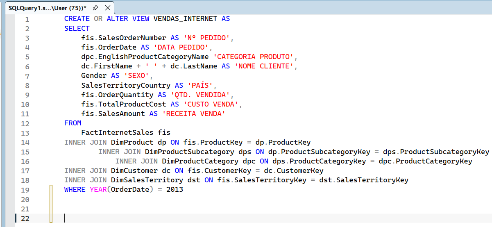
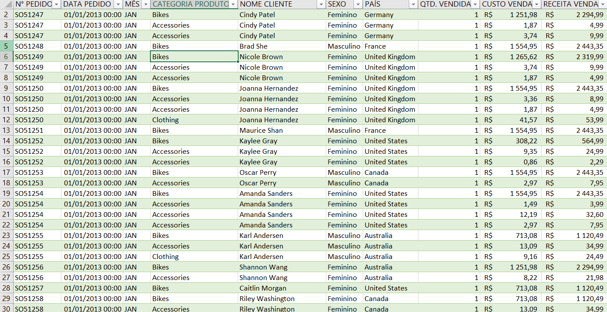
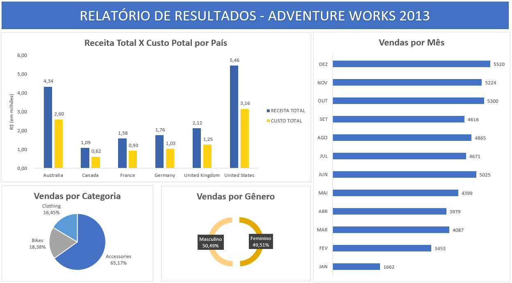

# Adventure Works 2013 — SQL Server + Excel

Análise de vendas da base Adventure Works 2013 utilizando SQL Server para extração e tratamento dos dados e Excel para visualização.

---

## Objetivo

Utilizar SQL para manipular e cruzar tabelas do banco de dados relacional, preparar uma fonte de dados consolidada e construir um relatório visual no Excel.

---

## Pipeline do projeto

```
SQL Server → View consolidada → Excel (Power Query) → Tabela Dinâmica → Relatório
```

**1. SQL Server**
Criação de uma View (`VENDAS_INTERNET`) unindo 5 tabelas via `INNER JOIN`:
- `FactInternetSales` — tabela fato de vendas
- `DimProduct` + `DimProductSubcategory` + `DimProductCategory` — hierarquia de produtos
- `DimCustomer` — dados dos clientes
- `DimSalesTerritory` — países/territórios

A query filtra apenas o ano de 2013 e retorna: nº pedido, data, categoria, cliente, sexo, país, quantidade vendida, custo e receita.

**2. Excel**
- Importação da view via Power Query
- Tabelas dinâmicas para agregação dos dados
- Relatório com gráficos de receita x custo por país, vendas por mês, por categoria e por gênero

---

## Indicadores do relatório

- Receita total x custo total por país
- Vendas mensais (jan–dez 2013)
- Distribuição por categoria de produto (Bikes, Accessories, Clothing)
- Distribuição por gênero (Masculino 50,49% / Feminino 49,51%)

---

## Ferramentas

SQL Server · Excel (Power Query · Tabela Dinâmica)

---

## Preview

### Query SQL


### Base de Dados


### Relatório Final

