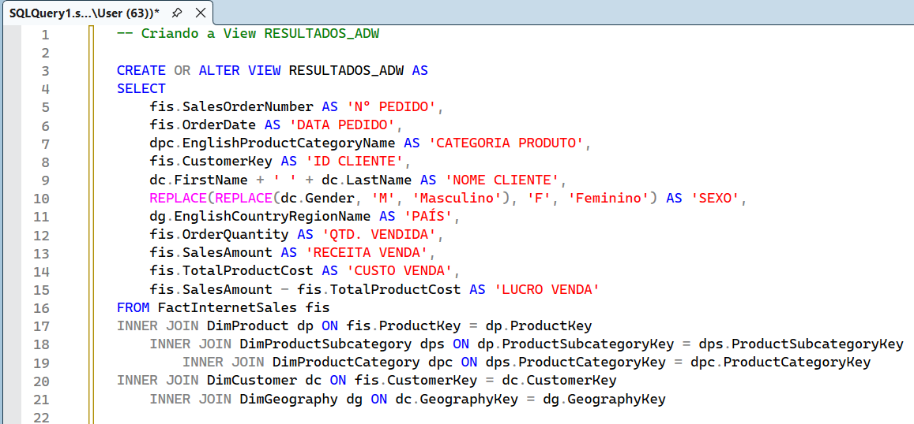
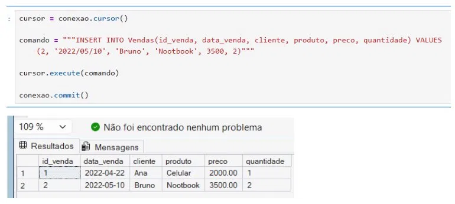

# Python + SQL Server Integration

Projeto de integração entre Python e SQL Server utilizando Jupyter Notebook, com foco em escrita e leitura de dados diretamente no banco via Python.

---

## Objetivo

Demonstrar a integração entre Python e SQL Server — inserindo dados no banco via Jupyter e depois lendo, tratando e visualizando esses dados com pandas e matplotlib.

---

## Pipeline do projeto

```
SQL Server → Jupyter Notebook (pyodbc) → pandas → matplotlib
```

**1. SQL Server**
Criação do banco de dados e tabela base para receber os dados inseridos via Python.

**2. Jupyter Notebook — Escrita**
- Conexão com o SQL Server via `pyodbc`
- Inserção de registros com `cursor.execute()` e `conexao.commit()`
- Uso de variáveis para parametrizar os inserts

**3. Jupyter Notebook — Leitura**
- Conexão com banco Contoso Retail DW
- Query SQL executada via Python com `pd.read_sql()`
- Agrupamento e contagem com `groupby()`
- Visualização com gráfico de barras via `pandas.plot()`

---

## Ferramentas

Python · Jupyter Notebook · SQL Server · pyodbc · pandas · matplotlib

---

## Preview

### Criação da tabela e insert no SQL Server


### Conexão e escrita via Python


### Leitura e visualização com pandas

